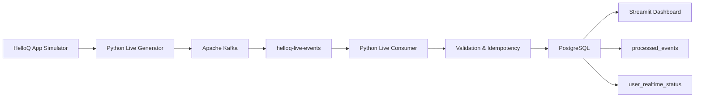

# ⚡ HelloQ Real-Time Data Engineering Pipeline

> A local, event-driven data platform that simulates a HelloQ-style matrimony application and processes user activity in near real time using **Python, Apache Kafka, PostgreSQL, and Streamlit**.

[](https://www.python.org/)
[](https://kafka.apache.org/)
[](https://www.postgresql.org/)
[](https://streamlit.io/)
[](#project-status)

---

## 📌 Project Overview

This project demonstrates how a real application can generate user activity events continuously, stream those events through Apache Kafka, process them with Python, store them in PostgreSQL, and expose live analytics through a Streamlit dashboard.

The project uses **synthetic application data** so it can be developed and run locally without relying on a paid cloud service.

### Example application events

- Registration started / completed
- Login / logout
- Profile views
- Interests sent / accepted
- Match creation
- Chat started
- Messages sent

The initial environment contains approximately **300 users and 2,000 historical events**, followed by newly generated live events.

---

## 🏗️ Architecture



### Event flow

```text
Application Activity
        ↓
Python Event Generator
        ↓
Kafka Producer
        ↓
helloq-live-events
        ↓
Kafka Consumer
        ↓
Validation + Duplicate Prevention
        ↓
PostgreSQL
        ↓
Real-Time User Metrics
        ↓
Streamlit Dashboard
```

---

## 🧰 Technology Stack

| Layer | Technology |
|---|---|
| Event generation | Python |
| Message streaming | Apache Kafka |
| Kafka mode | KRaft |
| Processing | Python |
| Database | PostgreSQL |
| Database access | psycopg2 |
| Dashboard | Streamlit + Plotly |
| Configuration | python-dotenv |
| Version control | Git / GitHub |
| Containers | Not used |

---

## ✨ Key Features

### 🔴 Real-Time Event Streaming
New application events are generated continuously and published to Kafka.

### 📦 Event Processing
Kafka consumers read events and validate required fields before writing them to PostgreSQL.

### 🛡️ Idempotent Processing
`event_id` is used as a unique identifier in the processed-event layer so duplicate messages are skipped instead of being inserted again.

### 📊 Real-Time Analytics
The project maintains user-level activity metrics such as:

- Total events
- Profile views
- Interests sent
- Matches created
- Chats started
- Messages sent
- Engagement score
- Current activity status
- Last activity time

### 📈 Live Dashboard
The Streamlit dashboard refreshes automatically and displays:

- Total users
- Active users
- Live events
- Live matches
- Live chats
- Live messages
- Event distribution
- City activity
- Event rate
- Latest events
- User real-time status

---

## 📂 Project Structure

```text
realtime-helloq-pipeline/
│
├── src/
│   ├── __init__.py
│   ├── producer.py
│   ├── consumer.py
│   ├── live_generator.py
│   └── live_consumer.py
│
├── dashboard.py
├── .env.example
├── .gitignore
├── requirements.txt
└── README.md
```

### Components

**`producer.py`**  
Reads the initial event history from PostgreSQL and publishes it to Kafka.

**`consumer.py`**  
Consumes the historical Kafka stream, validates events, prevents duplicate inserts, and updates user metrics.

**`live_generator.py`**  
Simulates new HelloQ application activity and publishes fresh events to Kafka.

**`live_consumer.py`**  
Consumes live events and writes them into the PostgreSQL processing and real-time metric layers.

**`dashboard.py`**  
Provides the Streamlit analytics interface.

---

## 🗄️ PostgreSQL Data Model

Database:

```text
helloq_realtime
```

Core tables:

```text
users
user_events
matches
chats
processed_events
user_realtime_status
```

### `users`
Application users and profile information.

### `user_events`
Initial application activity history.

### `matches`
Match relationships created by the application.

### `chats`
Chat activity associated with matches.

### `processed_events`
Kafka events that have been successfully processed.

### `user_realtime_status`
Latest user-level activity and engagement metrics.

---

## 📨 Kafka Topics

### Historical stream

```text
helloq-events
```

Used to replay the initial application event history.

### Live stream

```text
helloq-live-events
```

Used for newly generated application activity.

---

## ⚙️ Setup

### 1. Create the virtual environment

```powershell
python -m venv venv
```

Activate it:

```powershell
.\venv\Scripts\Activate.ps1
```

### 2. Install dependencies

```powershell
python -m pip install -r requirements.txt
```

### 3. Configure environment variables

Create a local `.env` file from `.env.example`.

Example:

```env
DB_HOST=localhost
DB_PORT=5432
DB_NAME=helloq_realtime
DB_USER=postgres
DB_PASSWORD=YOUR_POSTGRES_PASSWORD

KAFKA_BOOTSTRAP_SERVERS=127.0.0.1:9092
KAFKA_TOPIC=helloq-events
KAFKA_LIVE_TOPIC=helloq-live-events

EVENT_DELAY=0.1
LIVE_EVENTS=100
LIVE_EVENT_DELAY=1
```

> Never commit the real `.env` file. Only `.env.example` belongs in GitHub.

---

## ▶️ Run the Pipeline

### Start Kafka

Start the local Kafka broker first.

### Historical producer

```powershell
python -m src.producer
```

### Historical consumer

```powershell
python -m src.consumer
```

### Live consumer

Start this before the live generator:

```powershell
python -m src.live_consumer
```

### Live event generator

In another terminal:

```powershell
python -m src.live_generator
```

### Streamlit dashboard

```powershell
python -m streamlit run dashboard.py
```

Then open:

```text
http://localhost:8501
```

---

## 🔄 End-to-End Example

A user sends a message:

```text
User action
    ↓
Live Event Generator
    ↓
Kafka topic: helloq-live-events
    ↓
Live Consumer
    ↓
Validation
    ↓
processed_events
    ↓
user_realtime_status
    ↓
Streamlit
```

The same architecture can handle other events such as:

```text
login
profile_view
interest_sent
match_created
chat_started
logout
```

---

## 🛡️ Reliability Concepts Demonstrated

This project intentionally includes production-oriented patterns at a beginner-to-intermediate level:

- Event validation
- Explicit database transactions
- Manual Kafka offset commits
- Duplicate prevention using `event_id`
- Error handling
- Separation of historical and live streams
- Derived real-time user metrics

---

## 🎯 What This Project Demonstrates

This project demonstrates practical experience with:

```text
Event-driven architecture
Kafka producer / consumer
Real-time data ingestion
PostgreSQL data storage
Python data processing
Data validation
Idempotent processing
Real-time metrics
Streaming analytics
Streamlit dashboards
```

It is designed as a portfolio project to demonstrate the complete path:

```text
Generate → Stream → Consume → Validate → Store → Analyze
```

---

## 📊 Sample Scale

| Dataset / Component | Approximate Volume |
|---|---:|
| Users | 300 |
| Historical events | 2,000 |
| Live events per run | 100 |
| Kafka live topic | `helloq-live-events` |

The dataset is intentionally lightweight so the entire system can run locally while still demonstrating a realistic event-driven workflow.

---

## 🚀 Version 2

**Version 1 is complete. ✅**

Planned Version 2 will extend the processing layer with more advanced streaming capabilities, including:

```text
Apache Spark
Spark Structured Streaming
Window-based streaming analytics
Advanced stream processing
```

Target architecture:

```text
Application Events
        ↓
Kafka
        ↓
Spark Structured Streaming
        ↓
Validation / Transformation
        ↓
PostgreSQL / Analytical Storage
        ↓
Dashboard
```

---

## 📌 Project Status

```text
PostgreSQL Database        ✅
Historical Event Data      ✅
Kafka Broker               ✅
Kafka Topics               ✅
Python Producer            ✅
Python Consumer            ✅
Live Event Generator       ✅
Live Consumer              ✅
Idempotent Processing      ✅
Real-Time Metrics          ✅
Streamlit Dashboard        ✅

Version 1                   ✅ COMPLETED
```

---

## 👩‍💻 Author

**Riddhi Joshi**

Computer Science Engineering | Data Engineering

---

### ⭐ Portfolio Project

**Python • Apache Kafka • PostgreSQL • Streamlit • Plotly**

